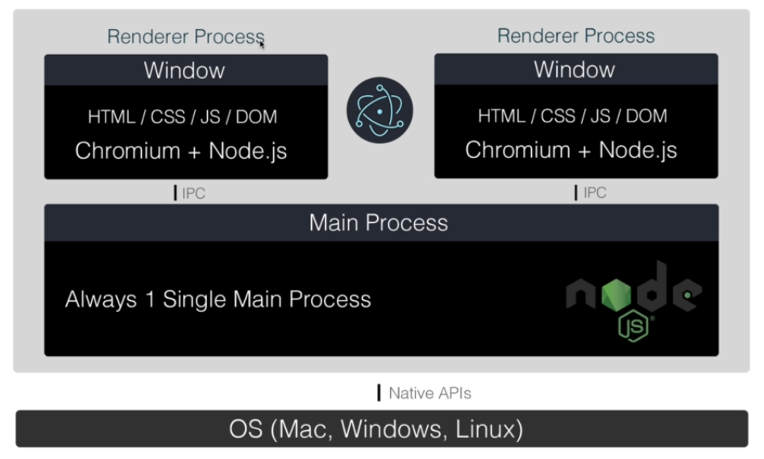

# Electron Noob

Building Cross Platform Desktop applications with Javascript, using Electron Framework.

Electron is an Open Source framework developed and maintained by GitHub. Electron allows for the developments of Desktop GUI applications using web technologies: It combines the **Chromium** rendering engine and the **Node.JS** runtime.

> Benefits of Desktop applications

- **Data Security**: Data is usually stored on the users' computer, rather than on a Server
- **Native APIs**: Access and interact with the OS hardware components, network ports, camera and much more.
- **Performance**: No network overhead of dealing with a web server
- **Deployment**: No server deployment and maintenance

> Benefits of ElectronJS

- **Single Codebase**: No need for separate languages and technologies for multiple platforms
- **Code Effectiveness**: Single codebase is much less expensive
- **Web Technologies**: Much easier to learn than the other languages used to created desktop applications
- **Desktop / Web Hybrid**: Easily create with a desktop and web version

> How Electron Works

- 

### Acknowledgement

[Brad Traversy's Electron Udemy Course](https://www.udemy.com/course/electron-from-scratch/)
