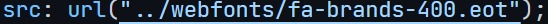

## Image Shrinker Electron App

Building a Desktop Application that compresses the image. We are going to use Electron (v13), Imagemin module to create the desired application.

### Run this application on local machine (Linux Only)

- `git clone https://github.com/nil1729/electron-demo.git`
- `npm install` to install all dependencies.
- To run in `development` mode. Change the `process.env.NODE_ENV` to `development` in `main.js`(Line 12)

### Vendor CSS and JS

- [Font Awesome](https://fontawesome.com/download)

  - CSS (`all.css`)
    - Save it on `/app/css`
  - WebFonts (all fonts)
    - Save all fonts on `/app/webfonts`
  - Setup the `all.css` file accroding to fonts
    - 

- [MaterializeCSS - CSS & JS](https://github.com/Dogfalo/materialize/releases/download/1.0.0/materialize-v1.0.0.zip)
  - CSS (`materialize.min.css`)
    - Save it on `/app/css`
  - JS (`materialize.min.js`)
    - Save it on `/app/js
